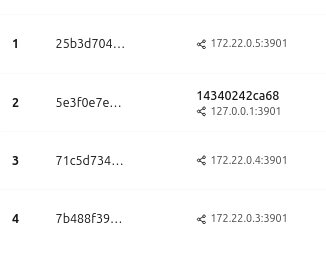

# Synology Garage S3 Multinode Cluster

This repository contains all assets and information to build a multinode garage cluster on a Synology Enterprise NAS. 
In this example, three volumes are used to distribute the files on different hardware.

## Features

- Multinode [Garage](https://garagehq.deuxfleurs.fr/) Cluster with Gateway Container
- NGINX & HTTPS support
- [Garage WebUI](https://github.com/khairul169/garage-webui)

## Prerequisites

The Docker Compose file requires the following folder structure on the Synology NAS:

```
/volume1/
└── s3-1/
    ├── app
    ├── certs/
    │   ├── ca
    │   └── pki/
    │       └── garage.domain.tld
    ├── gateway/
    │   ├── data
    │   └── meta
    ├── nginx/
    │   └── conf.d
    └── node1/
        ├── data
        └── meta
/volume2/
└── s3-2/
    └── node2/
        ├── data
        └── meta
/volume3/
└── s3-3/
    └── node3/
        ├── data
        └── meta
```

**Do not forget** to add your concatinated CA files in `/volume1/s3-1/certs/ca/ksgr-ca-certificates.crt` and the fullchain SSL certificate (`/volume1/s3-1/certs/pki/garage.domain.tld/fullchain.cer`) and the coresponding key (`/volume1/s3-1/certs/pki/garage.domain.tld/garage.domain.tld.key`)

## Installation

The following steps are required for the installation of the project.

### Container Project

1. Open the project overview in your Synology Container Manager and click on "Create".
2. Fill in the required information
    - Project name: garage-s3
    - Path: /volume1/s3-1/app
    - Source: docker-compose.yaml
3. Deactivate the Web portal settings and click "next"
4. Click "Done"

### Initial setup

Once the project was created successfully, you should be able to open the WebUI on the address `https://garage.domain.tld:8443` or `http://<nas-ip>:3909`. 

Navigate to the **Cluster** section. 
The garage gateway should already be displayed. 
To connect nodes 1-3 as well, the ID of the corresponding node must be added to the config. 

To do this, navigate to the container `garage-node1` in the Container Manager. Select `Open terminal` from the actions. 
The error message can be ignored as the container does not contain a shell.

Under `Create`, select `Launch with command` and enter the following command in the field that opens:

```shell
/garage node id
```

The following output should now appear.

```shell
No data 
xxxxxxxxxxxxxxxxxxxxxxxxxxxxxxxxxxxxxxxxxxxxxxxxxxxxxxxxxxxxxxxx@127.0.0.1:3901  
                                                                                 
To instruct a node to connect to this node, run the following command on that node:                                                                               
    garage [-c <config file path>] node connect xxxxxxxxxxxxxxxxxxxxxxxxxxxxxxxxxxxxxxxxxxxxxxxxxxxxxxxxxxxxxxxx@127.0.0.1:3901                                   
                                                                                 
This node identifier can also be added as a bootstrap node in other node's garage.toml files:                                                                     
    bootstrap_peers = [                                                          
        "xxxxxxxxxxxxxxxxxxxxxxxxxxxxxxxxxxxxxxxxxxxxxxxxxxxxxxxxxxxxxxxx@127.0.0.1:3901",   
        ...     
    ]                                                                                          
Security notice: Garage's intra-cluster communications are secured primarily by the shared secret value rpc_secret. However, an attacker that knows rpc_secret (for example if it leaks) cannot connect if they do not know any of the identifiers of the nodes in the cluster. It is thus a good security measure to try to keep them secret if possible.        
```

The Synology console is now deactivated because there is no open session to the container, which makes it impossible to copy individual values. 
However, the entire output can be copied with `CTRL+A` and `CTRL+C`.

Repeat this step for Node 2 and Node 3. Uncomment `bootstrap_peers` and copy all IDs and paste them into the `bootstrap_peers` option in the `garage.toml` file. Note that the localhost (127.0.0.1) is replaced by the container address `garage-node1:3901`, `garage-node2:3901` or `garage-node3:3901`.

```toml
bootstrap_peers = [
    "xxxxxxxxxxxxxxxxxxxxxxxxxxxxxxxxxxxxxxxxxxxxxxxxxxxxxxxxxxxxxxxx@garage-node1:3901",
    "xxxxxxxxxxxxxxxxxxxxxxxxxxxxxxxxxxxxxxxxxxxxxxxxxxxxxxxxxxxxxxxx@garage-node2:3901",
    "xxxxxxxxxxxxxxxxxxxxxxxxxxxxxxxxxxxxxxxxxxxxxxxxxxxxxxxxxxxxxxxx@garage-node3:3901"
]
```

Restart the entire project. 
The missing nodes should now be displayed in the **Cluster** section. 
These can now be configured to a layout. 
Do not forget to assign the gateway node as such. 
This is the only node that has a hostname.



## Usage

Create a bucket and a new key over the WebUI.
Assign the key with rw-permissions to the bucket.
Try to copy some files to the bucket.

> **Endpoint:** https://s3.garage.domain.tld

> **Region:** garage (customizable in the `garage.toml`)
